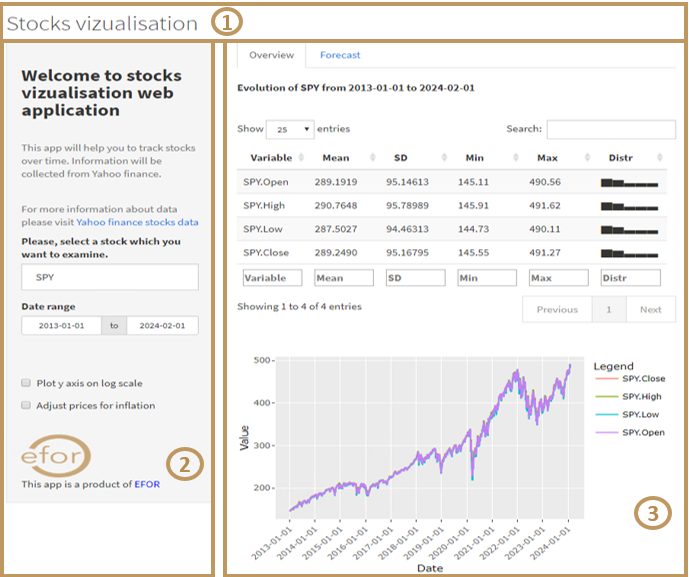
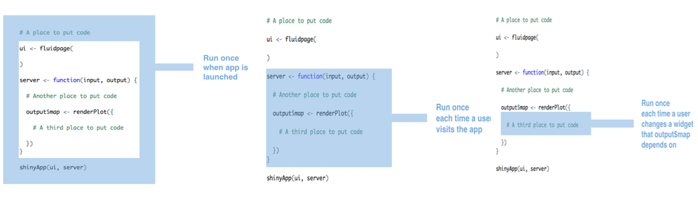

# Get started with shiny under R

## Overview
Shiny is an R (and recently python. I will produce a repo about it later) package that helps us to build interactive web applications (web apps) or dashboards straight from R easily and without necessarily requiring HTML, CSS, or JavaScript knowledge.

To get shiny package under R run $\texttt{install.packages("shiny")}$. For information this package contains eleven built-in examples that each demonstrate how Shiny works. Each example is a self-contained Shiny app. Run $\texttt{runExample()}$ to get them.

Usually, shiny app is contained in a single script named app.R and lives in a directory “mydir”. Then, it can be run with $\texttt{runapp(“mydir”)}$ or by clicking on the Run App button in the editor toolbar 
Note that before version 0.10.2, Shiny applications needed to be split into two separate files, server.R and ui.R, that include the code needed to define the UI and server components, respectively. This method is still supported in later versions of Shiny.

app.R script has three components:
- a user interface object $\textbf{ui}$
- a server function $\textbf{server}$
- and a call to the shinyApp function: $\texttt{shinyApp(ui = ui, server = server)}$

```{r}
library(shiny)

# Define UI ----
ui <- fluidPage(
  
)

# Define server logic ----
server <- function(input, output) {
  
}

# Run the app ----
shinyApp(ui = ui, server = server)

```

## User interface UI

The $\textbf{user interface (ui)}$ object controls the layout and appearance of shiny app. In other words, UI sets visual elements of our webapp such as logo, layout grid, fonts, [widgets](https://shiny.posit.co/r/gallery/widgets/widget-gallery/), navigation button layout, inputs, outputs… 

User Interface is very important as it allows interaction between the end-user and the webapp and thus contributes to the end-user experience. 

Use interface includes three main contents:
- $\textbf{Visual contents}$: text, logos, images, layout grids

- [Inputs](https://shiny.posit.co/r/gallery/widgets/widget-gallery/): objects with which users can interact with and send instructions to webapp usually in sidebarpanel

- $\textbf{Outputs}$: usually in main panel

Shiny page layout has basically three elements:



- A $\textbf{title panel}$  which sets the title of the webapp page $\textbf{(1)}$

-  A sidebar layout which will contain all visual elements of our webapp ($\texttt{sidebarLayout}$). Sidebar layout includes:

    - $\textbf{Sidebar panel}$: The sidebar panel is displayed with a distinct background color and typically contains [inputs](https://shiny.posit.co/r/gallery/widgets/widget-gallery/) controls (by default on left side) $\textbf{(2)}$

    - $\textbf{Main panel}$: The main panel area occupies 2/3 of the page and typically contains outputs. $\textbf{(3)}$. Outputs can be data table, images, text or figures. Below a cheatsheet of outputs functions.


## Server

In server function, we tell Shiny how to build the output object. It will be reactive as the code that builds the output object calls a widget value or an input.

Server function take two arguments:

- $\textbf{Input}$: corresponds to a list-like object of the current value of each widget/input defined in the ui. To call the value of a widget in server function, we just use R code $\texttt{input\$name\_of\_my\_widget}$. 

- $\textbf{Output}$: corresponds to a list-like object of each output object defined in the ui. Server function will build each R output object in this list using a specific code. To call output object in server function, just use $\texttt{output\$name\_of\_your\_output\_object}$.

## Execution

It’s important to understand Shiny app script execution to improve performance of our webapp by correctly placing commands used inside script  (load packages, load data, use external script, run general script, …)

In other words, where you place commands will determine how many times they are run (or re-run) into the script, which will in turn affect the performance of your app, since Shiny will run some sections your app.R script more often than others.


Based on this info, my advices are:
- Source scripts, load libraries, and read data sets at the beginning of app outside of the server function. Shiny will only run this code once, which is all you need to set your server up to run the R expressions contained in server. These are called global codes.

- Define user specific objects inside server function, but outside of any render* calls. These would be objects that you think each user will need their own personal copy of.

- Only place code that Shiny must rerun to build an object inside of a render* function. Shiny will rerun all of the code in a render* chunk each time a user changes a widget mentioned in the chunk. This can be quite often.

## Deploy

There are two basics ways to share a shiny app with R:

- Share your Shiny app as R scripts:
    - Send Shiny directory as a zip file by email
    - Host shiny scripts online
    - Zip shiny directory on a web page and in R run: runUrl( "<the weblink>")
    - Push shiny directory on Github and in R run: runGitHub( "<your repository name>", "<your user name>")
    - Copy and paste shiny scripts on Gist and in R run: runGist(“<your gist hash>")

- Share your Shiny app as a web page:
    - Using shinyapps.io. It's freeeee and easy use!!!
    - Shiny Server
    - Posit Connect: closer control, password admin or want to manage large volumes of traffic, you can purchase Posit Connect from Posit.


[Please click here to run app of this repo](https://oagbohouto.shinyapps.io/APP-4/?_ga=2.60336173.1667294675.1682961383-489944053.1682961383)
